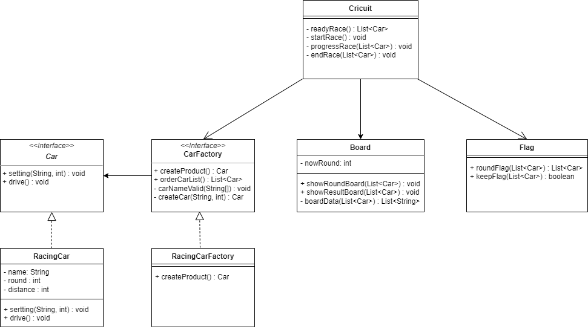

# 자동차 경주 게임

---
### 요구사항
* 주어진 횟수 동안 n대의 자동차는 전진 또는 멈출 수 있다.
* 각 자동차에 이름을 부여할 수 있다. 전진하는 자동차를 출력할 때 자동차 이름을 같이 출력한다.
* 자동차 이름은 쉼표(,)를 기준으로 구분하며 이름은 5자 이하만 가능하다.
* 사용자는 몇 번의 이동을 할 것인지를 입력할 수 있어야 한다.
* 전진하는 조건은 0에서 9 사이에서 random 값을 구한 후 random 값이 4 이상일 경우 전진하고, 3 이하의 값이면 멈춘다.
* 자동차 경주 게임을 완료한 후 가장 많이 전진한 자동차가 우승. 우승자는 한 명 이상일 수 있다.  
---
### 1. 구현 목표
* 객체 사이의 협력이 느껴지게 구현
* 팩토리 디자인 패턴 적용
* SOLID 원칙을 지켜서 구현
* 요구사항 기능 구현

### UML

### 2. 자체 평가
* SRP  
  * 출력과 판정을 분리할 필요가 있어보임    
  * Car 객체 내에서 진행여부를 판정하는데 괜찮을까?
* OCP 
  * 확장가능성에 대한 고려 필요 (자동차 유형 변경, 룰 변경)
* DIP 
  * 상위객체인 Car를 사용해서 구현했는데 RacingCar의 함수가 필요한경우가 있었음
 